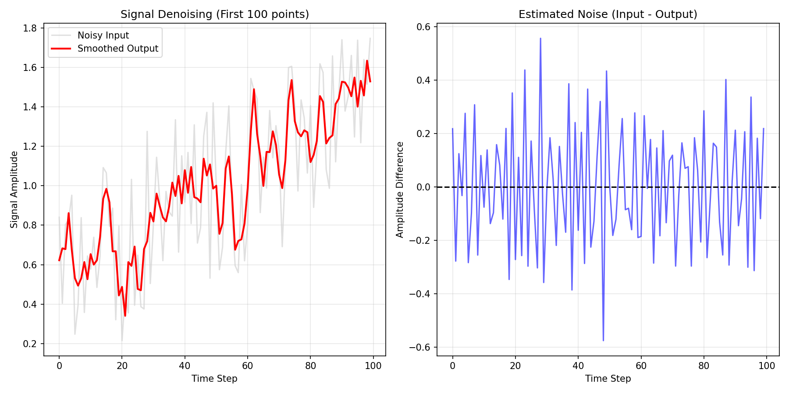
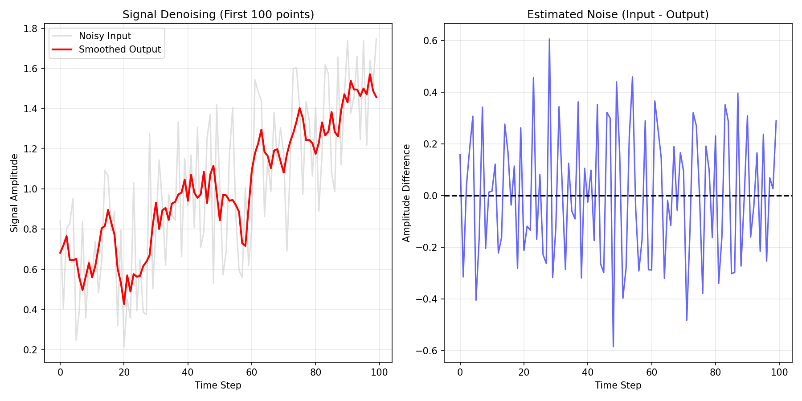

# CUDA Signal Denoising at Scale

## Project Description
This project implements a high-throughput parallel Moving Average Filter using CUDA to perform signal processing on massive datasets. The application generates large-scale synthetic signal data—simulating noisy sensor or audio streams—and utilizes a custom GPU kernel to filter and smooth the data in parallel.

This project demonstrates "scale" by effectively processing datasets ranging from thousands to tens of millions of data points, leveraging the massive parallelism of the GPU to outperform sequential processing methods.

## Technical Implementation

### 1. The Core Algorithm: Moving Average Kernel
The heart of the project is the `movingAverageKernel`, which functions as a **1D Stencil Operation**. Instead of iterating through the data sequentially (as a CPU would), this kernel assigns a single CUDA thread to calculate the smoothed value for exactly one data point.


* **Thread Indexing:** The kernel calculates a unique global index (`idx`) for every thread using the standard CUDA formula:
    `int idx = blockDim.x * blockIdx.x + threadIdx.x;`
    This maps the hardware thread hierarchy (blocks and threads) to the linear data array.
* **Windowing Logic:** For every valid index `idx`, the thread opens a local loop that sums the values of neighboring elements (e.g., left 2 neighbors, itself, right 2 neighbors) and calculates the average.
* **Boundary Handling:** The kernel includes boundary checks (`if (neighborIdx >= 0 && neighborIdx < numElements)`) to prevent out-of-bounds memory access at the start and end of the array.

### 2. Scalability & Dynamic Sizing
The project meets the requirement for processing "large amounts of data" through **Dynamic Grid Sizing**.
* **Grid Calculation:** The host code calculates `blocksPerGrid` dynamically based on the user-provided input size (`-n` argument): `(numElements + threadsPerBlock - 1) / threadsPerBlock`.
* **Synthetic Data Generation:** To avoid I/O bottlenecks when demonstrating massive scale (50M+ points), the host generates synthetic noisy sine waves (`sin(i * 0.01f) + noise`) directly in memory.

### 3. Memory Architecture
The code employs a standard **Host-to-Device transfer pattern**:


1.  **Host Allocation:** `std::vector<float>` is used for automatic memory management on the CPU.
2.  **Device Allocation:** `cudaMalloc` reserves linear memory on the GPU VRAM.
3.  **Transfer:** `cudaMemcpy` moves raw noisy data to the GPU (Host to Device).
4.  **Processing:** The GPU kernel reads from Global Memory (`d_input`) and writes to Global Memory (`d_output`).
5.  **Retrieval:** Smoothed data is copied back to the host (`cudaMemcpy` Device to Host) for verification.

## Repository Contents
* **`main.cu`**: The core C++ and CUDA source code implementing the signal generation and Moving Average kernel.
* **`Makefile`**: Build script to compile the project using `nvcc`.
* **`run.sh`**: Shell script to automate compilation, execution on multiple dataset sizes, and plot generation.
* **`plot_results.py`**: Python script to generate visualization plots (`.png`) from the output CSV files.
* **`results.md`**: A report summarizing the execution time and performance metrics.

## Requirements
* **CUDA Toolkit**: `nvcc` compiler must be installed and in your PATH.
* **Make**: For building the executable via the Makefile.
* **Python 3**: Required for the visualization script.
    * **Libraries**: `pandas`, `matplotlib`, `numpy`.
    * **Installation**: 
      ```bash
      pip install pandas matplotlib numpy
      ```

## Compilation
To compile the C++ CUDA executable, navigate to the project directory and run:

```bash
make
```

This will generate the `signal_denoise` executable.

## Execution

### Automated Run (Recommended)

The provided shell script compiles the code, runs it on three different "scales" of data (Small, Medium, Large), and generates proof-of-execution plots automatically.

```bash
chmod +x run.sh
./run.sh

```

### Manual Execution

You can also run the denoiser manually with custom arguments:

```bash
./signal_denoise -n <num_elements> -w <window_size> -o <output_file>

```

**Arguments:** 

* `-n`: Number of data points to generate (e.g., `1000000`).
* `-w`: Size of the smoothing window (e.g., `5`).
* `-b`: Threads per block (default: `256`).
* `-o`: Output CSV filename (default: `output.csv`).

To generate a plot manually after running the C++ code:

```bash
python3 plot_results.py output.csv

```

## Proof of Execution

Upon running `run.sh`, the following artifacts will be generated to demonstrate successful execution:

1. **CSV Logs**:
* `output_small.csv`: Raw data for 10,000 elements.
* `output_medium.csv`: Raw data for 1,000,000 elements.
* `output_large.csv`: Raw data for 50,000,000 elements.


2. **Visualization Images**:
* `output_small.png`: Visualizes the noisy input vs. the smoothed output for the small dataset.
    
* `output_medium.png`: Demonstrates the kernel working on a larger, denser dataset. Example below:

   


These images serve as visual proof that the GPU kernel correctly filtered the noise from the signal.

## Rubric Compliance

* **Code Repository**: Complete source provided with `README.md` and CLI support.


* **Support Files**: Includes `Makefile` and `run.sh` for easy compilation and execution.


* **Proof of Execution**: Generates CSV logs and PNG plots demonstrating execution on large datasets.


* **Project Description**: Clearly defines the algorithm (Moving Average) and the scale of data processed.